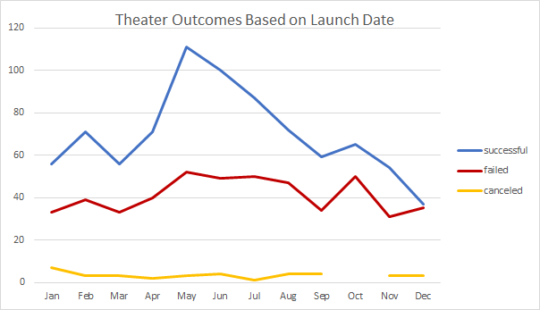
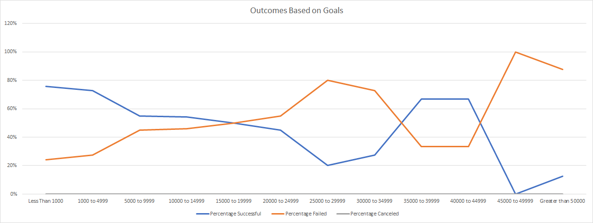

# Kickstarter Analysis with Excel
Performing analysis on Kickstarter data to uncover trends.

## Overview of Project
Play writer Louise wants to launch a Crowdfunding campaign for her play Fever. Louise's estimated budget for her play is $10,000+. The purpose of this project is to analyze Kickstarter Crowdfunding campaign dataset to help her understand campaigns start to finish and set her campaigns to mirror other successful campaigns in the same category. 

### Purpose
The purpose of this analysis is to help Louise set her campaigns for her play Fever to mirror other successful ones in the same category in a short amount of time. 

## Analysis and Challenges

### Analysis of Outcomes Based on Launch Date
Outcome Based on Launch Date analysis was performed using the following steps: 
1. Created a new column labeled "Years" in the Kickstarter worksheet. 
2. The Year() function was used to extract the year from the "Date Created Conversion" Column.
3. Using the Fill Handle extended the formula for the entire dataset.
4. Created a pivot table from the KickStarter worksheet and placed the pivot table in a new sheet.
5. Filter the pivot table using PivotTable Fields and dragging and dropping the following:
    - Parent Category and Years to Filters
    - Outcome to Columns
    - Date Created Converstion to Rows
    - Outcome to Values
6. Remove the Automatically created Year and Quarter from the Rows. Row Labels were automatically grouped by months of the year.
7. Filtered the column labels to show only “successful,” “failed,” and “canceled.”
8. Filtered the “Parent Category” to show only the data for “theater.”
9. Sort the campaign outcomes in descending order so “successful” is first.
10. The final pivot table had successful, failed, and canceled theater Kickstarter campaigns by month.
11. Created a line chart from the pivot table to visualize the relationship between outcomes and the launch month.
12. A final line chart was created to displays the successful, failed, and canceled theater Kickstarter campaigns by the launch month (See image below) 

### Analysis of Outcomes Based on Goals
Outcome Based on Goals analysis was performed using the following steps:
1. In the new sheet, the following columns were created to hold the data:
    - Goal
    - Number Successful
    - Number Failed
    - Number Canceled
    - Total Projects
    - Percentage Successful
    - Percentage Failed
    - Percentage Canceled
2. In the “Goal” column, following dollar-amount ranges were created so projects can be grouped based on their goal amount:
    - Less Than 1000
    - 1000 to 4999
    - 5000 to 9999
    - 10000 to 14999
    - 15000 to 19999
    - 20000 to 24999
    - 25000 to 29999
    - 30000 to 34999
    - 35000 to 39999
    - 40000 to 44999
    - 45000 to 49999
    - Greater than 50000
3. The `=COUNTIFS(Kickstarter!$D:$D,"<1000",Kickstarter!$R:$R,"plays",Kickstarter!$F:$F,"successful")` formula was used to populate the “Number Successful" for Less Than 1000 Goal range. 
4. For other goals ranges under “Number Successful", the formula was extended using Fill Handle and ranges were changed. 
5. The formula was copied from cell B2: B13 and pasted to Cell C2: C13 and D2: D13. "successful" outcome was changed to "failed" for C2: C13 and "canceled" for D2: D13. 
6. The `=SUM(B2+C2+D2)` formula was used to populate the “Total Projects” for Less Than 1000 Goal range.
7. For other goals ranges under "Total Projects", the formula was extended using Fill Handle. 
8. The `=B2/E2` formula was used to populate the "Percentage Successful" for Less Than 1000 Goal range. 
9. For other goals ranges under "Percentage Successful", the formula was extended using Fill Handle. 
10. The `=C2/E2` formula was used to populate the "Percentage Failed" for Less Than 1000 Goal range. 
11. For other goals ranges under "Percentage Failed", the formula was extended using Fill Handle. 
12. The `=D2/E2` formula was used to populate the "Percentage Cancelled"  for Less Than 1000 Goal range. 
13. For other goals ranges under "Percentage Cancelled", the formula was extended using Fill Handle. 
14. Cell format for "Percentage Successful", "Percentage Failed" and "Percentage Cancelled" columns were changed using % button under Home - Format Cells.
15. A final line chart was created to displays the percentage successful, failed, and canceled plays Kickstarter campaigns by the goals (See image below)

### Challenges and Difficulties Encountered
A Challenge encountered during the outcomes based on Launch Date analysis was associated with the "Years" column. The Year() function used to extract the year from the "Date Created Conversation" was resulting in incorrect data output. On further analysis, the cell format for the "Years" column was set to the years in excel. Solution: the existing "Years" column was deleted. A new "Years" column was created with default cell format. 

## Results

- What are two conclusions you can draw about the Outcomes based on Launch Date?
>- May have the highest number of successful companies followed by June for parent category theater. A recommendation for Louise would be to launch the Crowdfunding campaign in May. 
>- December has the lowest number of successful campaigns followed by November for parent category theater. A recommendation for Louise would be to not launch the Crowdfunding campaign in December. 

- What can you conclude about the Outcomes based on Goals?
>Louise's estimated budget goal for her play Fever is $10,000+. 54% of the Crowdfunding campaign with sub-category plays that had a goal from $10,000 to $14,999 were successful. Therefore, there is a 54% chance of Louis's Crowdfunding campaign for her play Fever would be successful. 

- What are some limitations of this dataset?
>Limitations of this dataset: 
> - There is no way to verify the outliers, missing, or incorrect data since the dataset was obtained from a secondary source. 
>- Data is limited to Kickstarter(website) Crowdfunding campaigns.
>- Genres of plays could affect the Crowdfunding campaign's success rate. The current dataset does not include the genre's data. 
>- The city or state of plays could affect the Crowdfunding campaign's success rate. The current dataset does not include the city and state data.

- What are some other possible tables and/or graphs that we could create?
>Other possible tables and/or graphs: 
> - Create a pivot table and chart associated with subcategory plays outcomes and launch date
> - Create a pivot table and chart associated with category theater outcomes and deadline date 
> - Create a pivot table and chart associated with subcategory plays outcomes and deadline date
> - Create a table and chart for Outcome based on pledged amount similar Outcome based on Goals.
